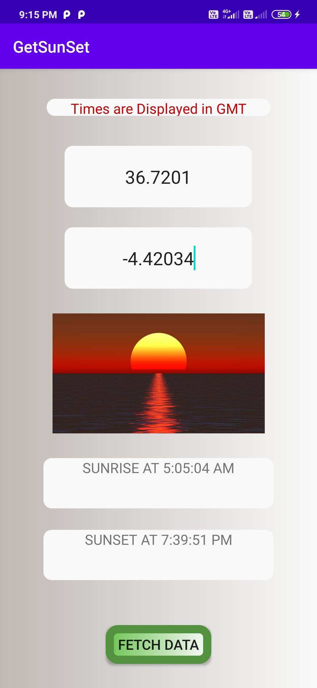

# Sunrise Sunset Times App

This app is made using Kotlin in Android Studio. 

This app fetches sunrise and sunset time for a place, given its latitude and longitude in GMT.

<h3>Attributions:</h3>
https://sunrise-sunset.org/api for their api.

<h2>Screenshots:</h2>
 

This project is made just to utilize API services and JSON requests as part of Udemy course.
